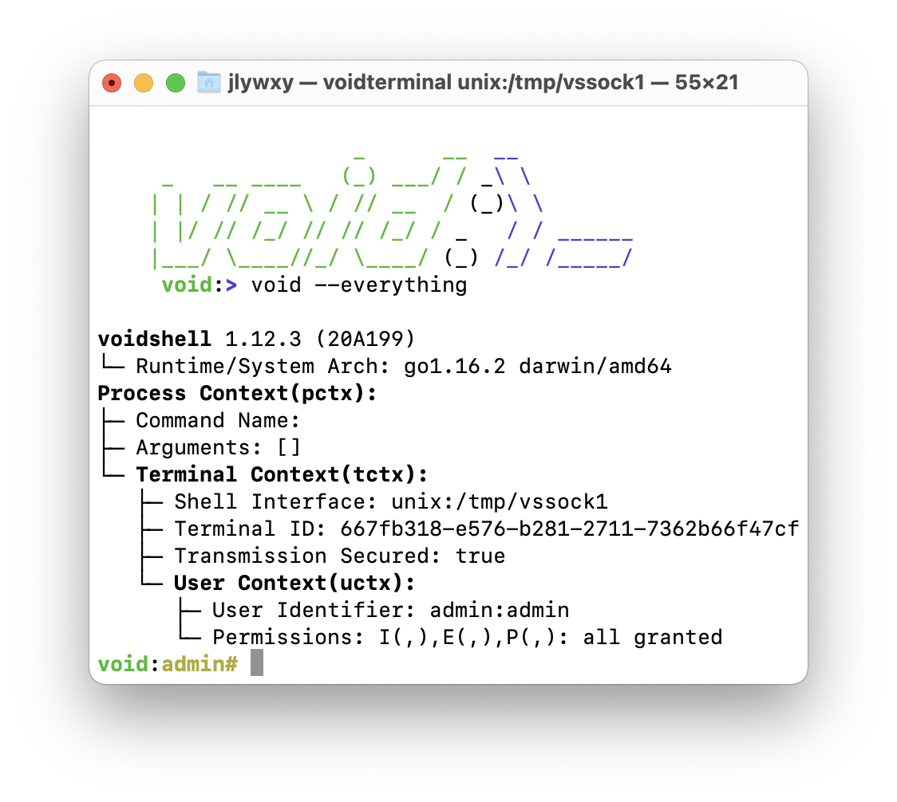

# voidshell
voidshell is a CUSTOM shell service

current version: 1.11.1 (2021.3.18)
## build voidshell
```shell
$ go clean
$ go build
```
## launch voidshell
```shell
$ ./void
```
to launch in background, type
```shell
$ screen -R voidsh
$ ./void
```
...or make a voidshell.service file to let systemctl manage voidshell service on linux.

## connect to voidshell
### using netcat
```shell
$ stty raw; nc -U ./voidsh
```
### using socketterminal
see https://github.com/jlywxy/socketterminal
```shell
$ ./socketterminal ./voidsh
```
voidshell listen to one default unix socket connections only(when launching)<br/>
to change that default unix socket file path, modify [configuration files](#conffile.sock)
for multiple kind of terminal connecting concurrently, use that default socket to configure, see builtin command [shutil](#shutil)

## configure voidshell
configuraton file: .vsrc
### socket file path
<span id="conffile.sock"></span>
```json
{
  "socket": "./socketfile"
}
```
### password for internal command "sudo"
"password_encrypted" should be sha256 encrypted
```json
{
  "password_encrypted": "sha256(password)"
}
```

## plugin development
plugin for voidshell is node.js script file,
located in plugin/root directory
### create a plugin
create a file located in plugin/root directory<br/>
plugin template shown below:
```javascript
/*init code,do not modify*/
var ctx={};module.exports={ init: (_ctx)=>{ctx=_ctx}, run: main }

function main(){
    ctx.print("Hello void.")
    ctx.exit()
}
```
plugin entrypoint is function main.
### using plugin
simply type plugin name and arguments in voidshell
```shell
void:>plugin-name
Hello void.
```
### calling convention

data comes with `ctx`: 
* plugin name and arguments: <br/>
   `ctx.args[plugin_name, plugin_arg1, plugin_arg2, ...]`
* input function: <br/>
   `ctx.input(prompt,callback_func)`
* output function: <br/>
   `ctx.print(content)`
* exit the plugin: <br/>
   `ctx.exit()`
* void format text transformer: <br/>
   `ctx.format(text)`
   
### void format text(VFT)
* converts vft tag to VT100 terminal colors
* only supports forecolor and bold format
* format:`<vft {red|green|yellow|blue} {bold|}>formatting text</vft>`,<br/>
  escape tag is `"<\vft>"` and `"<\/vft>"`
* example: `"black<vft red bold>red bold</vft>black<vft blue>blue</vft>black<\vft green bold>shouldn't formatteded<\/vft>"`<br/>
  output should be:
  black<span style="color: red; font-weight: bold">red bold</span>black<span style="color: blue">blue</span>black&lt;vft green bold&gt;shouldn't formatted&lt;/vft&gt;<br/>
* different implements in vft.go and vft.js are equivalent
  
## builtin commands
### info
displays os info and shell/terminal info
```shell
void:>info

                    _      __  __           
     _   __ ____   (_) ___/ / _\ \          
    | | / // __ \ / // __  / (_)\ \         
    | |/ // /_/ // // /_/ / _   / / ______    
    |___/ \____//_/ \____/ (_) /_/ /_____/  
     void:>void --everything

Void System 1.1
    Golang Version: go1.15.6 darwin/amd64
    Current Working Directory: *
    System Arch: darwin/amd64
Process Context(pctx):
    Command Name: info
    Arguments: []
    Shell Context(sctx): 
        Terminal Name: *
        Privileged: false
```
### exec
run bash commands in voidshell
```shell
void:>exec ls
README.md main.go   plugin    void.png  voidsh    vokernel  voruntime voshell
```
### shutil
<span id="shutil"></span>
tool for managing socket servers<br/>
```shell
void:>shutil
usage [--options network address]
  --open: create a new shell socket server
  --kill: close specific socket server
  --list: list all shell socket server
```
network: "tcp" or "unix"(unix socket)<br/>
address: "ip:port" for "tcp", or socket filename for "unix"<br/><br/>
examples:<br/>
opening new socket servers:
```shell
void:>shutil --open tcp:127.0.0.1:9001
void:>shutil --open unix:/tmp/vssock1
```
close a socket server:
```shell
void:>shutil --kill unix:/tmp/vssock1
````
list all opened socket server
```shell
void:>shutil --list
opening socket shell: 
unix:./voidsh (default)
tcp:127.0.0.1:9001
unix:/tmp/vssock1
```
the default socket neither could be reopened nor be killed.
### exit
simply exit the shell(close terminal only, won't shut down service)
```shell
void:>exit
```
<br/>
other commands are now reserved for further development.<br/>
see in voruntime/internal.go: internal

## miscellaneous
* voidshell and socketterminal(https://github.com/jlywxy/socketterminal) use the protocol of VT100 terminal. 